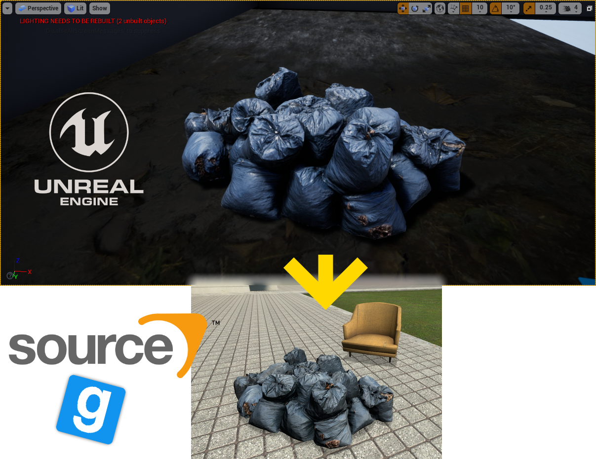

# Convert Unreal Engine .uasset to Source Engine .mdl

This guide describes how to convert an asset from Unreal Engine to Source Engine. It was written pretty swiftly so there will be mistakes. Nevertheless it should fulfil it's purpose, allowing you to bring static models over from UE to Source Engine games like Garry's Mod, Team Fortress 2, Counter-Strike: Source etc...

The guide can be found as a Word Document (`converting-uasset-to-mdl.docx`) or as a .pdf (`converting-uasset-to-mdl.pdf`)

With the guide come all downloads described in the guide. You can find these in the `dependencies` directory and can use these if the sites mentioned in the guide are offline.

## Requirements

The guide is written with **Windows** in mind, but you can also use **Linux** or **MacOS for parts** of the process.

* Software required:
  * [UModel](https://www.gildor.org/en/projects/umodel#files) *is available for Windows and Linux (only the Windows 32-bit .exe is included)*
  * [Blender](https://www.blender.org/download/) *is available cross-platform (Windows, Linux, MacOS)*
  * [VTFEdit](http://nemesis.thewavelength.net/index.php?p=41) *only works on Windows, but you can use [Wine](https://www.winehq.org/) to run VTFEdit if you also install the .NET platform within Wine. Alternatively you could use [XnView MP](https://www.xnview.com/en/xnviewmp/) to manipulate VTF's on Linux. On MacOS [you'll have to improvise](https://steamcommunity.com/sharedfiles/filedetails/?id=527715471).*
  * A Source Game to test the model in. *I used Garry's Mod writing this guide. It allows me to easily spawn the model through the prop-menu.*
* Skills required:
  * You have some basic knowledge about Blender, like how to navigate the different options, manipulate on-screen objects and move the camera.
  * You have a lot of patience
  * You track back through the instructions when something fails and try again, more diligently.
  * You re-read everything you type, making sure you make no mistakes.

## Source Limitations

**Roughness map** (included in example assets)

With this guide comes an example that has a Roughness map (or glossiness/smoothness map). Sadly this can not be added with the same simplicity the normal map is added. [This document from the Valve Developer Wiki](https://developer.valvesoftware.com/wiki/Adapting_PBR_Textures_to_Source) describes how to adapt a PBR Roughness map to Source by using a bit of math and a [specular mask](https://developer.valvesoftware.com/wiki/$envmapmask).

## Guide Table of Contents

These are the chapters in the guide:

- Table of Contents
- About this Guide and Disclaimer
- First Step: Exporting the uasset Meshes to psk(x) and Textures to tga
- Step Two: Import the .pskx Mesh in Blender
  - (Required only once) Download and install Blender
  - (Required only once) Installing the .psk importer for Blender
  - Importing the .pskx Mesh into Blender
- Step Three: Apply and preview the Texture using the existing UV maps
  - (Optional) Step: Apply and preview the normal map if there is one	
- Step Four: Exporting this model to an .smd and consequently an .mdl for Source Engine
  - (Required only once) Installing the Blender Source Tools for blender
  - Export the .smd-file
  - Creating a rough collision model
- Step Five: Compiling the .smd to an .mdl using a .qc
- Step Six: Converting the .tga textures to .vtf’s with an accompanying .vmt	
  - (Required only once) Install VTFEdit
  - Convert the .tga to .vtf
  - Create a .vmt file
- Extra: Checking for problems
  - Finding the right Source Engine Material (.vmt) name
  - Showing the collision model
  - (After testing in-game) my model is way too small!
- Sources used

## Credits

* [VTFEdit by Ryan Gregg/Nemesis](http://nemesis.thewavelength.net/index.php?c=178)
* [Blender Source Tools by Artfunkel](https://github.com/Artfunkel/BlenderSourceTools)
* [Blender3D Import psk psa addon](https://github.com/Befzz/blender3d_import_psk_psa)
* [UE Viewer/umodel by Konstantin Nosov/Gildor](https://www.gildor.org/en/projects/umodel#files)
* [Example Trashbag model and textures from this pack by Scans Factory](https://www.unrealengine.com/marketplace/en-US/product/scans-abandoned-factory-buildings-day-night-scene)
* [Angry-Mob.com](https://angry-mob.com/convert-unreal-engine-uasset-to-source-engine-mdl/), *for publishing this rough (but useful) guide as an article.*
* *Guide by yours truly ([Lutt.online](https://github.com/luttje))*

